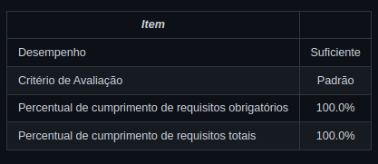
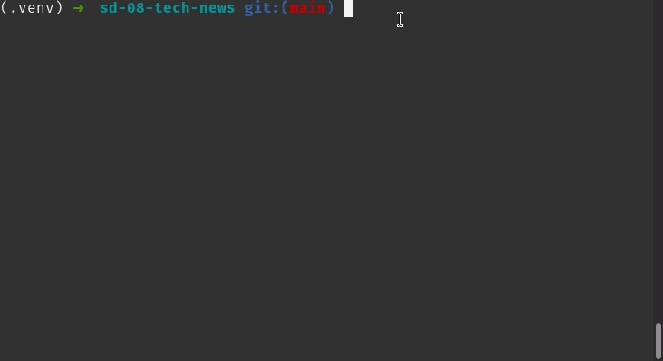

# Boas vindas ao repositório do projeto de Tech News

Esse projeto foi desenvolvido como projeto bônus no módulo de Ciência da Computação, no curso de Desenvolvimento Web da [Trybe](https://www.betrybe.com/?utm_medium=cpc&utm_source=google&utm_campaign=Brand&utm_content=ad03_din_h), o objetivo desse projeto foi colocar em pratica meus conhecimentos em raspagem de dados, escrever meus próprios módulos e importá-los em outros códigos.

---

## Preview do projeto

# Sumário

- [Boas vindas ao repositório do projeto Task Organizer!](#boas-vindas-ao-repositório-do-projeto-task-organizer)
- [Desenvolvimento](#Desenvolvimento)
- [Estrutura de diretórios e arquivos](#Estrutura-de-diretórios-e-arquivos)
- [Instalação do projeto localmente](#Instalação-do-projeto-localmente)
- [Funções do projeto](#Funções-do-projeto)
  - [fetch](#fetch)
  - [scrape_novidades](#scrape_novidades)
  - [scrape_next_page_link](#scrape_next_page_link)
  - [scrape_noticia](#scrape_noticia)
  - [get_tech_news](#get_tech_news)
  - [search_by_title](#search_by_title)
  - [search_by_date](#search_by_date)
  - [search_by_source](#search_by_source)
  - [search_by_category](#search_by_category)
  - [top_5_news](#top_5_news)
  - [top_5_categories](#top_5_categories)
  - [analyzer_menu](#analyzer_menu)
  - [Implementação das funcionalidades do menu](#Implementação-das-funcionalidades-do-menu)
- [Link para o portfolio](#Link-para-o-portfolio)

---

## Estrutura de diretórios e arquivos

~~~ bash
.
├── .trybe
│   └── requitements.json
├── .vscode
│   └── settings.json
├── tech_news
│   ├── analyzer
│   │   ├── ratings.py
│   │   └── search_engine.py
│   ├── database.py
│   ├── menu.py
│   └── scraper.py
├── tests
│   ├── assets
│   ├── __init__.py
│   ├── generate_fixtures.py
│   ├── test_menu.py
│   ├── test_ratings.py
│   ├── test_scraper.py
│   └── test_search_engine.py
├── .editorconfig
├── .gitignore
├── dev-requirements.txt
├── project.toml
├── README.md
├── requirements.txt
├── setup.cfg
├── setup.py
├── teste_manual.gif
└── trybe.yml
~~~

---

## Desenvolvimento

Este projeto foi desenvolvido utilizando Python.

Através dessa aplicação, é possível fazer raspagem de dados do site  [TecMundo](https://www.tecmundo.com.br/novidades).

## Instalação do projeto localmente

Após cada um dos passos, haverá um exemplo do comando a ser digitado para fazer o que está sendo pedido, caso tenha dificuldades e o exemplo não seja suficiente, não hesite em me contatar em *iago.pferreiravr@gmail.com*.

Passo 1. Abra o terminal e crie um duretório no local de sua preferência com o comando `mkdir`:

~~~bash
mkdir projetos-iago
~~~

Passo 2. Entre no diretório que você acabou de criar:

~~~bash
cd projetos-iago
~~~

Passo 3. Clone o projeto:

~~~bash
git clone git@github.com:IagoPFerreira/tech-news.git
~~~

Passo 4. Após terminado a clonagem, entre no diretório que você acabou de clonar:

~~~bash
cd tech-news
~~~

Passo 5. Crie o ambiente virtual para rodar o projeto

~~~bash
python3 -m venv .venv && source .venv/bin/activate
~~~

Passo 6. Instale todas as dependências do projeto

~~~bash
python3 -m pip install -r dev-requirements.txt
~~~

⚠️ **Atenção** ⚠️

Essa aplicação foi desenvolvida utilizando Python 3, é necessário para o funcionamento correto desse projeto que o Python esteja instalado na sua máquina, caso você não o tenha instalado, você pode fazer o download do Python direto da [documentação do Python](https://www.python.org/downloads/).

Essa aplicação foi desenvolvida utilizando MongoDB, é necessário para o funcionamento correto desse projeto que o MongoDB esteja instalado na sua máquina, caso você não o tenha instalado, você pode seguir o passo a passo da [documentação do MongoDB para a instalação](https://docs.mongodb.com/manual/installation/).

---

✍️ **Teste manual**: abra um terminal Python importando as funções de interesse através do comando `python3 -i tech_news/arquivo_de_interesse.py` e as invoque utilizando diferentes parâmetros. Exemplo:

[Voltar ao sumário](#Sumário)

---

## Funções do projeto

### fetch

local: `tech_news/scraper.py`

Antes de fazer scrape, precisamos de uma página! Esta função é responsável por fazer a requisição HTTP ao site Tecmundo e obter o conteúdo HTML.
Alguns cuidados foram tomados: como a nossa função poderá ser utilizada váras vezes em sucessão, na nossa implementação nos asseguramos que tivesse um Rate Limit de uma requisição por segundo.

- A função recebe uma URL
- A função faz uma requisição HTTP `get` para esta URL utilizando a função `requests.get`, que é uma função interna do Python
- A função retorna o conteúdo HTML da resposta.
- Caso a requisição seja bem sucedida com `Status Code 200: OK`, é retornado seu conteúdo de texto;
- Caso a resposta tenha o código de status diferente de `200`, é retornado `None`;
- Caso a requisição não receba resposta em até 3 segundos, ela é ser abandonada (este caso é conhecido como "Timeout") e a função retorna None.

✍️ Teste manual: abra um terminal Python importando estas funções através do comando `python3 -i tech_news/scraper.py` e as invoque utilizando diferentes parâmetros. Exemplo:

~~~python
>>> html = fetch(url_da_noticia)
>>> scrape_noticia(html)
~~~

[Voltar ao sumário](#Sumário)

---

### scrape_novidades

local: `tech_news/scraper.py`

Para conseguirmos fazer o scrape da página de uma notícia, primeiro precisamos de links para várias páginas de notícias. Estes links estão contidos na página Novidades (<https://www.tecmundo.com.br/novidades>).

Esta função faz o scrape da página Novidades para obter as URLs das páginas de notícias. Foi utilizada a biblioteca Parsel, para obter os dados que desejados de cada página.

- A função deve receber uma string com o conteúdo HTML da página Novidades (<https://www.tecmundo.com.br/novidades>)
- A função faz o scrape do conteúdo recebido para obter uma lista contendo as URLs das notícias listadas.
- A função retorna esta lista.
- Caso não encontre nenhuma URL de notícia, a função retorna uma lista vazia.

✍️ Teste manual: abra um terminal Python importando estas funções através do comando `python3 -i tech_news/scraper.py` e as invoque utilizando diferentes parâmetros. Exemplo:

~~~python
>>> html = fetch(url_da_noticia)
>>> scrape_novidades(html)
~~~

[Voltar ao sumário](#Sumário)

---

### scrape_next_page_link

local: `tech_news/scraper.py`

Para buscar mais notícias, precisamos fazer a paginação, e para isto, vamos precisar do link da próxima página. Esta função é responsável por fazer o scrape deste link.

- A função deve receber como parâmetro uma `string` contendo o conteúdo HTML da página de novidades (<https://www.tecmundo.com.br/novidades>)
- A função faz o scrape deste HTML para obter a URL da próxima página.
- A função retorna a URL obtida.
- Caso não encontre o link da próxima página, a função retorna `None`

[Voltar ao sumário](#Sumário)

---

### scrape_noticia

local: `tech_news/scraper.py`

Agora que sabemos pegar páginas HTML, e descobrir o link de notícias, é hora de fazer o scrape dos dados que procuramos!

- A função deve receber como parâmetro o conteúdo HTML da página de uma única notícia da Tecmundo
- A função, no conteúdo recebido, busca as informações das notícias para preencher um dicionário com os seguintes atributos:
  - `url` - link para acesso da notícia. Ex: "https://www.tecmundo.com.br/mobilidade-urbana-smart-cities/155000-musk-tesla-carros-totalmente-autonomos.htm"
  - `title` - título da notícia. Ex: "Musk: Tesla está muito perto de carros totalmente autônomos"
  - `timestamp` - data e hora da notícia. Ex: "2020-07-09T11:00:00"
  - `writer` - nome da pessoa autora da notícia. Ex: "Nilton Kleina". Se a informação não for encontrada, salve este atributo como `None`
  - `shares_count` - número de compartilhamento da notícia. Ex: `61`. Se a informação não for encontrada, salve este atributo como `0` (zero)
  - `comments_count` - número de comentários que a notícia recebeu. Ex: `26`
  - `summary` - o primeiro parágrafo da notícia. Ex:"O CEO da Tesla, Elon Musk, garantiu que a montadora está muito perto de atingir o chamado nível 5 de autonomia de sistemas de piloto automático de carros. A informação foi confirmada em uma mensagem enviada pelo executivo aos participantes da Conferência Anual de Inteligência Artificial (WAIC, na sigla em inglês). O evento aconteceu em Xangai, na China, onde a montadora comemora resultados positivos de mercado."
  - `sources` - lista contendo fontes da notícia. Ex: ["Venture Beat", "Source 2"]
  - `categories` - lista de categorias que classificam a notícia. Ex: ["Mobilidade Urbana/Smart Cities", "Veículos autônomos", "Tesla", "Elon Musk"]

- Exemplo de um retorno da função com uma notícia específica:

~~~json
{
  "url": "https://www.tecmundo.com.br/mobilidade-urbana-smart-cities/155000-musk-tesla-carros-totalmente-autonomos.htm",
  "title": "Musk: Tesla está muito perto de carros totalmente autônomos",
  "timestamp": "2020-07-09T11:00:00",
  "writer": "Nilton Kleina",
  "shares_count": 61,
  "comments_count": 26,
  "summary": "O CEO da Tesla, Elon Musk, garantiu que a montadora está muito perto de atingir o chamado nível 5 de autonomia de sistemas de piloto automático de carros. A informação foi confirmada em uma mensagem enviada pelo executivo aos participantes da Conferência Anual de Inteligência Artificial (WAIC, na sigla em inglês). O evento aconteceu em Xangai, na China, onde a montadora comemora resultados positivos de mercado.",
  "sources": ["Venture Beat"],
  "categories": [
    "Mobilidade Urbana/Smart Cities",
    "Veículos autônomos",
    "Tesla",
    "Elon Musk"
  ]
}
~~~

✍️ Teste manual: abra um terminal Python importando estas funções através do comando `python3 -i tech_news/scraper.py` e as invoque utilizando diferentes parâmetros. Exemplo:

~~~python
>>> html = fetch(url_da_noticia)
>>> scrape_noticia(html)
~~~

[Voltar ao sumário](#Sumário)

---

### get_tech_news

local: `tech_news/scraper.py`

Esta função busca um número específico de notícias no site do Techmundo e as adiciona no banco de dados, logo após retorna as notícias encontradas.

- A função deve receber como parâmetro um número inteiro `n` e buscar as últimas `n` notícias do site.
- Utilizando as funções `fetch`, `scrape_novidades`, `scrape_next_page_link` e `scrape_noticia` para buscar as notícias e processar seu conteúdo.
- As notícias buscadas são inseridas no MongoDB;
- Para acessar o banco de dados, foram imporadas e utilizadas as funções que já foram fornecidas prontas pela Trybe em `tech_news/database.py`;
- Após inserir as notícias no banco, a função retorna estas mesmas notícias.

✍️ Teste manual: abra um terminal Python importando esta função através do comando `python3 -i tech_news/analyzer/scraper.py` e invoque a função utilizando diferentes parâmetros. Exemplo: `get_tech_news(5)`.

[Voltar ao sumário](#Sumário)

---

### search_by_title

local: `tech_news/analyzer/search_engine.py`

Esta função faz buscas por título.

- A função deve receber uma string com um título de notícia
- A função busca as notícias do banco de dados por título
- A função retorna uma lista de tuplas com as notícias encontradas nesta busca.
Exemplo:

~~~python
[
  ("Título1_aqui", "url1_aqui"),
  ("Título2_aqui", "url2_aqui"),
  ("Título3_aqui", "url3_aqui"),
]
~~~

✍️ Teste manual: abra um terminal Python importando esta função através do comando `python3 -i tech_news/analyzer/search_engine.py` e invoque a função utilizando diferentes parâmetros. Exemplo: `search_by_title("Musk")`.

[Voltar ao sumário](#Sumário)

---

### search_by_date

local: `tech_news/analyzer/search_engine.py`

Esta função irá busca as notícias do banco de dados por data.

- A função deve receber como parâmetro uma data no formato "aaaa-mm-dd"
- A função busca as notícias do banco de dados por data.
- A função retorna uma lista de tuplas com as notícias encontradas nesta busca.
- Caso a data seja inválida, ou esteja em outro formato, uma exceção `ValueError` é lançada com a mensagem `Data inválida`.
- Caso nenhuma notícia seja encontrada, é retornada uma lista vazia.

✍️ Teste manual: abra um terminal Python importando esta função através do comando `python3 -i tech_news/analyzer/search_engine.py` e invoque a função utilizando diferentes parâmetros. Exemplo: `search_by_date("2020-11-11")`.

[Voltar ao sumário](#Sumário)

---

### search_by_source

local: `tech_news/analyzer/search_engine.py`

Esta função busca as notícias por fonte.

- A função deve receber como parâmetro o nome da fonte completo.
- A função busca as notícias do banco de dados por fonte.
- A função retorna uma lista de tuplas com as notícias encontradas nesta busca.
- Caso nenhuma notícia seja encontrada, é retornada uma lista vazia.
- A busca é *case insensitive*

✍️ Teste manual: abra um terminal Python importando esta função através do comando `python3 -i tech_news/analyzer/search_engine.py` e invoque a função utilizando diferentes parâmetros. Exemplo: `search_by_source("Venture Beat")`.

[Voltar ao sumário](#Sumário)

---

### search_by_category

local: `tech_news/analyzer/search_engine.py`

Esta função busca as notícias por categoria.

- A função deve receber como parâmetro o nome da categoria completo.
- A função busca as notícias do banco de dados por categoria.
- A função retorna uma lista de tuplas com as notícias encontradas nesta busca.
- Caso nenhuma notícia seja encontrada, é retornada uma lista vazia.
- A busca é *case insensitive*

✍️ Teste manual: abra um terminal Python importando esta função através do comando `python3 -i tech_news/analyzer/search_engine.py` e invoque a função utilizando diferentes parâmetros. Exemplo: `search_by_category("Tesla")`.

[Voltar ao sumário](#Sumário)

---

### top_5_news

local: `tech_news/analyzer/ratings.py`

Esta função lista as cinco notícias mais populares; nosso critério de popularidade é a soma dos compartilhamentos e comentários.

- A função busca as notícias do banco de dados e calcula a sua "popularidade" somando seu número de compartilhamentos e comentários.
- A função ordena as notícias por ordem de popularidade.
- Em caso de empate, o desempate é por ordem alfabética de título.
- A função retorna uma lista de tuplas com as notícias encontradas nesta busca, porém limitado a 5 notícias.
- Caso haja menos de cinco notícias, no banco de dados, são retornadas todas as notícias existentes;
- Caso não haja notícias disponíveis, é retornada uma lista vazia.

✍️ Teste manual: abra um terminal Python importando esta função através do comando `python3 -i tech_news/analyzer/ratings.py` e invoque a função utilizando diferentes parâmetros. Exemplo: `top_5_news()`.

[Voltar ao sumário](#Sumário)

---

### top_5_categories

local: `tech_news/analyzer/ratings.py`

Esta função lista as cinco categorias com maior ocorrência no banco de dados.

- As categorias são ordenadas por ordem alfabética.
- As top 5 categorias da análise são retornadas em uma lista no formato `["category1", "category2"]`;
- Caso haja menos de cinco categorias, no banco de dados, são retornadas todas as categorias existentes;
- Caso não haja categorias disponíveis, é retornada uma lista vazia.

✍️ Teste manual: abra um terminal Python importando esta função através do comando `python3 -i tech_news/analyzer/ratings.py` e invoque a função utilizando diferentes parâmetros. Exemplo: `top_5_categories()`.

[Voltar ao sumário](#Sumário)

---

### analyzer_menu

local: `tech_news/menu.py`

Esta função é o menu do nosso programa. Através dele poderemos operar as funcionalidades que criamos. É um menu de opções, em que cada opção pede as informações necessárias para disparar uma ação.

- O texto exibido pelo menu é exatamente:

~~~bash
Selecione uma das opções a seguir:
 0 - Popular o banco com notícias;
 1 - Buscar notícias por título;
 2 - Buscar notícias por data;
 3 - Buscar notícias por fonte;
 4 - Buscar notícias por categoria;
 5 - Listar top 5 notícias;
 6 - Listar top 5 categorias;
 7 - Sair.
~~~

- Caso a opção `0` seja selecionada, é exibida a mensagem "Digite quantas notícias serão buscadas:"

- Caso a opção `1` seja selecionada, é exibida a mensagem "Digite o título:";

- Caso a opção `2` seja selecionada, é exibida a mensagem "Digite a data no formato aaaa-mm-dd:";

- Caso a opção `3` seja selecionada, é exibida a mensagem "Digite a fonte:";

- Caso a opção `4` seja selecionada, é exibida a mensagem "Digite a categoria:";

- Caso a opção não exista, é exibida a mensagem de erro "Opção inválida" na `stderr`.

📌 A função `input` é utilizada para receber a entrada de dados da pessoa usuária.

✍️ Teste manual: dentro de um ambiente virtual onde seu projeto foi configurado, digite o comando `tech-news-analyzer`, o menu deve ser exibido. Isto acontece pois durante a configuração inicial do projeto já configuramos para que a função seja corretamente chamada quando este comando seja invocado.

[Voltar ao sumário](#Sumário)

---

### Implementação das funcionalidades do menu

local: `tech_news/menu.py`

- Quando selecionada uma opção do menu, e inseridas as informações necessárias, a ação adequada é realizada.

- Caso a opção `0` seja selecionada, a importação é feita utilizando a função `get_tech_news`;

- Caso a opção `1` seja selecionada, a importação é feita utilizando a função `search_by_title` e seu resultado é impresso em tela;

- Caso a opção `2` seja selecionada, a exportação é feita utilizando a função `search_by_date` e seu resultado é impresso em tela;

- Caso a opção `3` seja selecionada, a importação é feita utilizando a função `search_by_source` e seu resultado é impresso em tela;

- Caso a opção `4` seja selecionada, a exportação é feita utilizando a função `search_by_category` e seu resultado é impresso em tela;

- Caso a opção `5` seja selecionada, a raspagem é feita utilizando a função `top_5_news` e seu resultado é impresso em tela;

- Caso a opção `6` seja selecionada, a raspagem é feita utilizando a função `top_5_categories` e seu resultado é impresso em tela;

- Caso a opção `7` seja selecionada, é encerrada a execução do script e é exibida a mensagem "Encerrando script";

- Caso alguma exceção seja lançada, a mesma é capturada e sua mensagem é exibida na saída padrão de erros (`stderr`).

✍️ Teste manual: dentro de um ambiente virtual onde seu projeto foi configurado, digite o comando `tech-news-analyzer`, assim você conseguirá interagir com o menu.

[Voltar ao sumário](#Sumário)

---

⚠️ **Este projeto ainda possui espaço para melhorias e novas implementações, ambas serão feitas com o tempo, caso você tenha alguma sugestão, envie-a para mim no meu e-mail *iago.pferreiravr@gmail.com*** ⚠️

---

## Link para o portfolio

Você pode ir ao meu portfolio e conferir os outros projetos que eu já desenvolvi

<https://iagopferreira.github.io/portfolio-react>
